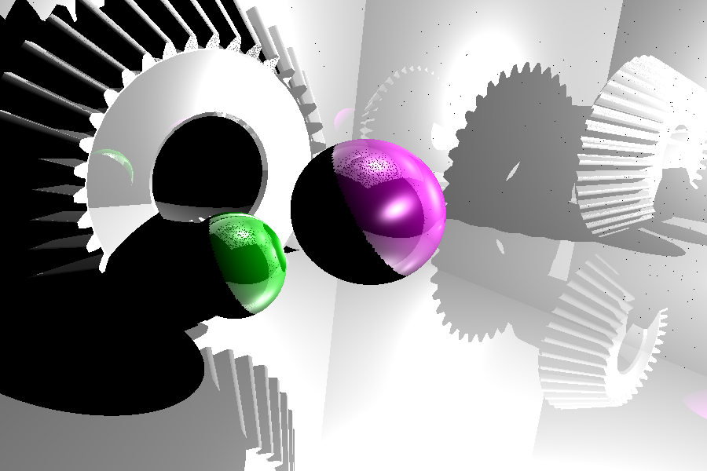

# vtk-raytracing

The goal of this project is to use [VTK](https://pypi.org/project/vtk/) with Python and implement a raytracing algorithm.

## Theoretical approach

With theoretical approach, it is simply basic mathematics :

```python
# Source : https://medium.com/swlh/ray-tracing-from-scratch-in-python-41670e6a96f9
# I replaced the `numpy` with `glm` to improve computation speed
def sphere_intersect(center, radius, ray_origin, ray_direction):
    b = 2 * glm.dot(ray_direction, ray_origin - center)
    c = glm.length2(ray_origin - center) - radius * radius
    delta = b * b - 4 * c
    if delta > 0:
        t1 = (-b + sqrt(delta)) / 2
        t2 = (-b - sqrt(delta)) / 2
        if t1 > 0 and t2 > 0:
            return min(t1, t2)
    return None
```

## VTK approach

Whereas with VTK, there are several aspects to deal with :
- **intersection** : get intersection coordinates, intersected triangle and their normales
- **interpolation** : get the interpolated normale according to the data collected

Intersection function :
```python
def sphere_intersect(obj, ray_origin, ray_direction):
    p1 = ray_origin
    p2 = ray_origin + 10 * ray_direction
    # `10` is a hyperparameter, it depends on the distance from the camera to objects
    # (how far a ray should go away)

    points = vtk.vtkPoints()
    cellIds = vtk.vtkIdList()

    iD = obj.obbtree.IntersectWithLine(p1, p2, points, cellIds)
    pointData = points.GetData()
    noPoints = pointData.GetNumberOfTuples()
    noIds = cellIds.GetNumberOfIds()

    pointsInter = []
    cellIdsInter = []
    for idx in range(noPoints):
        pointsInter.append(pointData.GetTuple3(idx))
        cellIdsInter.append(cellIds.GetId(idx))

    if iD != 0:
        return glm.length(pointsInter[0] - p1), cellIdsInter[0], pointsInter[0]
    else:
        return None, None, None
```

Interpolation function :
```python
def interpolation(points, normals, target):
    A, B, C = map(glm.vec3, points)
    normals = list(map(glm.vec3, normals))
    target = glm.vec3(target)
    AC = A - C
    BC = B - C
    TC = target - C
    u, v, _ = glm.inverse(glm.mat3(AC, BC, glm.cross(AC, BC))) * TC
    w = 1 - u - v
    return u * normals[0] + v * normals[1] + w * normals[2]
```

## Comparaison between theoretical computation and VTK computation

|         |  |
| :---------------------------------------------: | :----------------------: |
| Theory (no mesh, only mathematical computation) | VTK (objects are meshes) |
