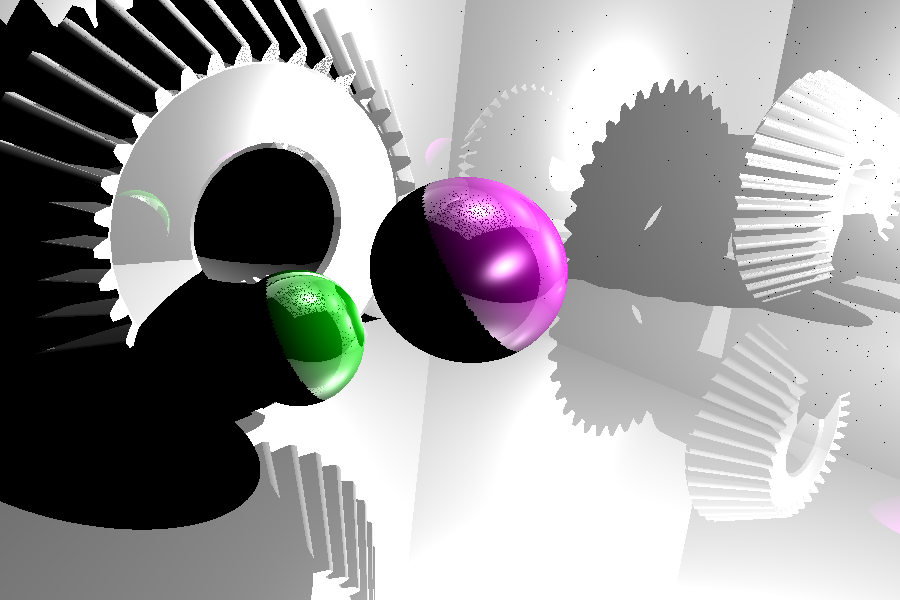
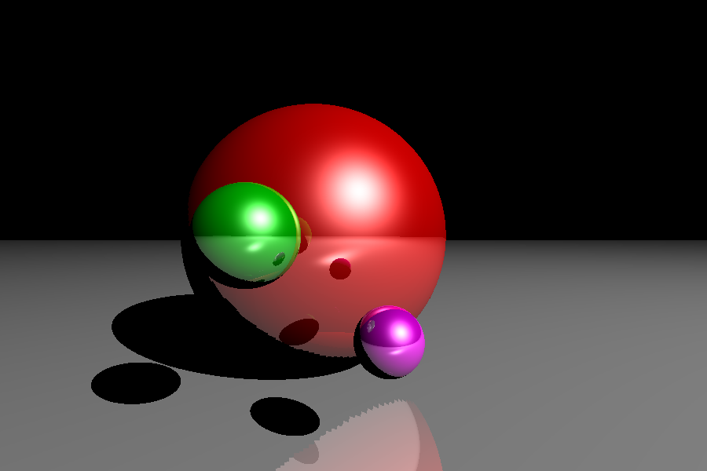
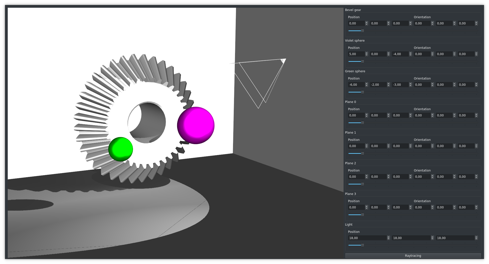

# Raytracing using VTK



## Goal

The goal of this project is to use [VTK](https://pypi.org/project/vtk/) with Python and implement a raytracing algorithm.

## Installation

```
git clone https://github.com/bourbonut/vtk-raytracing
cd vtk-raytracing
python3 setup.py install
```

## Theoretical approach

With theoretical approach, it is simply basic mathematics :

```python
# Source : https://medium.com/swlh/ray-tracing-from-scratch-in-python-41670e6a96f9
# I replaced the `numpy` with `glm` to improve computation speed
def sphere_intersect(center, radius, ray_origin, ray_direction):
    b = 2 * glm.dot(ray_direction, ray_origin - center)
    c = glm.length2(ray_origin - center) - radius * radius
    delta = b * b - 4 * c
    if delta > 0:
        t1 = (-b + sqrt(delta)) / 2
        t2 = (-b - sqrt(delta)) / 2
        if t1 > 0 and t2 > 0:
            return min(t1, t2)
    return None
```

## VTK approach

Whereas with VTK, there are several aspects to deal with :
- **intersection** : get intersection coordinates, intersected triangle and their normales
- **interpolation** : get the interpolated normale according to the data collected

Intersection function :
```python
def find_intersection(obbtree, ray_origin, ray_direction):
    """
    Return:
    - the distance between the initial point and the intersection
    - the id of intersected cell
    - the coordinates of intersected point
    """
    p1 = ray_origin
    p2 = ray_origin + 500 * ray_direction

    points = vtk.vtkPoints()
    cellIds = vtk.vtkIdList()

    iD = obbtree.IntersectWithLine(p1, p2, points, cellIds)
    pointData = points.GetData()
    noPoints = pointData.GetNumberOfTuples()
    noIds = cellIds.GetNumberOfIds()

    pointsInter = []
    cellIdsInter = []
    for idx in range(noPoints):
        pointsInter.append(pointData.GetTuple3(idx))
        cellIdsInter.append(cellIds.GetId(idx))

    if iD != 0:
        return glm.length(pointsInter[0] - p1), cellIdsInter[0], pointsInter[0]
    else:
        return None, None, None
```

Interpolation function :
```python
def interpolation(points, normals, target):
    """
    Return interpolated normal
    """
    A, B, C = map(glm.vec3, points)
    normals = list(map(glm.vec3, normals))
    target = glm.vec3(target)
    AC = A - C
    BC = B - C
    TC = target - C
    u, v, _ = glm.inverse(glm.mat3(AC, BC, glm.cross(AC, BC))) * TC
    w = 1 - u - v
    return u * normals[0] + v * normals[1] + w * normals[2]
```

## Comparaison between theoretical computation and VTK computation

|         |  |
| :---------------------------------------------: | :-----------------------: |
| Theory (no mesh, only mathematical computation) | VTK (objects are meshes)  |

## Usage

Run `python main.py` to start the following menu :
```
0. test-config.json
1. spheres-config.json
2. bevel-gear-config.json
3. exit
```

You can use arrows to select the configuration you want. For instance, if you want to try `spheres-config.json` configuration, press down and enter.
Note: You can see description with the right arrow (example below with `spheres-config.json`):
```
Scene:{width: 900, height: 600, zoom: 1, max_depth: 3}
Objects{
   Object_0{
       sphere<theta: 150, phi: 150, center: [-0.2, 0, -1], radius: 0.7>
       material<color: [1, 0, 0], ambient: 0.1, diffuse: 0.7, specular: 1, shininess: 100, reflection: 0.5>
       position : [-0.2, 0, -1]
   }
   Object_1{
       sphere<theta: 150, phi: 150, center: [0.1, -0.3, 0], radius: 0.1>
       material<color: [1, 0, 1], ambient: 0.1, diffuse: 0.7, specular: 1, shininess: 100, reflection: 0.5>
       position : [0.1, -0.3, 0]
   }
   Object_2{
       sphere<theta: 150, phi: 150, center: [-0.3, 0, 0], radius: 0.15>
       material<color: [0, 1, 0], ambient: 0.1, diffuse: 0.6, specular: 1, shininess: 100, reflection: 0.5>
       position : [-0.3, 0, 0]
   }
   Object_3{
       plane<height translation: -0.7>
       material<color: [1, 1, 1], ambient: 0.1, diffuse: 0.6, specular: 1, shininess: 100, reflection: 0.5>
       position : [0, 0, 0]
   }
}
Camera:{position : [0, 0, 1]}
Light:{position: [5, 5, 5], cone angle: 30}
Selected object, where light focuses on, is 0
Name of the simulation : spheres
```
To quit the "describer menu", use left or up or down arrow.

Once you select a configuration, the program opens a window where you can see the scene before raytracing :


Now, you can move the camera, objects.
To start the raytracing algorithm, simply press the "Raytracing button".

## Improvements to do

1. Unfortunatly, changing position/orientation of objects with GUI controllers doesn't affect real position / orientation (but light and camera are taken into account).
2. Zoom must be changed manually in configuration files (and also width and height).
3. Camera controllability is not convenient.
